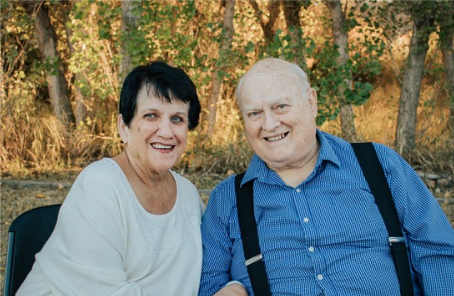

# 2025-06 Edition

It has been almost 3 years since my last family letter. Things have drastically changed since June 2025 from my family and myself. If you aren't in the mood for reading some rather depressing things, skip the sections labeled 'depressing'

I'm trying a new method of sending out these emails using a newsletter service. If you don't want to receive these emails you can unsubscribe at this link.

I am now 45 and definitely feeling my age. I had my first colonoscopy recently which was certainly an experience. Sarah was killing it with the jokes while driving me their and waiting with me before the procedure. I'll spare you most except for the one about my doctor. His name is Dr. Vulcano. Sarah asked a nurse if he got into this business because of his love of things that expel toxic gasses. Perhaps you needed to be there but I was laughing my head off.

The prep wasn't as bad as everyone seems to indicate but it [certainly cleared my head](https://www.quotes.net/mquote/51889). Everything went smoothly and aside from some benign stuff I was given a clear bill of health. I did however wake up mid-procedure. I won't bore you but I was very confused and when I asked someone a question the anesthesiologist immediately gave me some more night-night juice.

## Depressing

As you may or may not know my family experienced multiple losses in the past couple of years. In October or thereabouts my father went in for an amputation of an infected leg. While there he became delirious and I had to take over their finances. He recovered mostly and was able to return home but a few months later, around the time of my birthday he suffered a stroke and his ability to speak was taken from him. It was devastating as he was always a gregarious individual who loved telling jokes and chatting people up. We ended up finding an inhome assistant to help take care of them but to keep costs down they were only there during the day. During the morning and evening hours my brothers and I stepped in. Luckily my work was exceptionally flexible and I was able to work from their house to be able to assist. At night we had provided my parents a button that would trigger notifications on our phones that something was up that required assistance. I personally racked up a ton of mileage traveling back and forth to assist. It was one of the hardest things I had gone through to date.

While there my mother started exhibiting signs of memory deteorization. She would forget where she was when we drove around places. One time she started frying an egg and never came back to it. Luckily someone was there at the time to prevent a house fire situation. It progressively got worse with her thinking she was younger and needing to go home. She would walk outside and wait inside the car to go to her home. Eventually she started wandering away down the street. It became more and more of a burden on the in home assistants. We eventually had to look into assisted living facilities. This terrified me because my parents had always said that they didn't want to live in a facility if possible. Growing up, we lived down the street from a 'retirement home' that we sometimes went to for church activities. It was frightening and smelly. Luckily we managed to find a decent and economical choice in [Eternal Spring of Gilbert](https://eternalspringaz.com/). We initially wanted to have them in the assisted living side of the house where they could live on their own with some assistance. They moved in in April and ended up having to be moved to the memory care side of the facility within a few weeks. That really hurt but made a lot of sense. Luckily they were able to continue living together.

During this time my brothers and I took over every facet of their lives other than daily care. I became the paperwork, finance and appointment czar. That entailed getting Power of Attorney, documenting medications, scheduling appointments, traveling to and from appointments, managing funds and payments. It was exhausting. Trying to gain access to accounts, both financial and electronic, was an eye opening experience. To everyone who have people who depend on you I say, MAKE A PLAN for your incapacitation or death. I ended writing a "in case of death" letter so that in the event I can't be reached, Sarah or someone else knows how to access funds, accounts and resources while attempting to sort through what will surely be a tramatic experience (because I am an irreplaceable delight 😉). My brother Mark, who was going through his own trials at the time moved into their house and started to prep it for sale. I wouldn't trade his experience for mine in a million years. The flooring all had to be ripped up, termite damage had to be repaired, the house had to be purged of bed bugs, the rooms all had to be painted and walls patched, the posessions and belongings had to be sorted through and then sold, stored or donated. This was a monumental task and I am thankful to this day that he was able to handle this. My brother Jacob, was the caretaker and 'ubereats' guru. He always made sure that mom and dad were well stocked with supplies, food and treats. Thank you Jacob. Each of us and our spouses, during this time, had a number of rather awkward experiences and surprises. We ended up comparing notes and vying for the top most awkward experience. I think we all came out losers though.

My father struggled in his new environment and was in and out of the hospital multiple times. Eventually he suffered from a minor cut on his foot that due to neglect became infected and eventually caused him to pass away. This was the hardest thing I had ever experienced to date and caused me and my brothers to weep like babies. My father was not peaceful or comfortable in his final days and for that I will be eternally saddened. His funeral however was very nice and a whole community of people came to pay their respects and to support his family. Even writing this I am tearing up. I heard many great stories and I got to tell one of my favorite stories that my dad would tell. My mom was still mostly present but had some moments where confusion was setting in. At one point we made her ['business cards'](https://www.canva.com/design/DAF0Xzs0jS4/_OhlK-JLB7aAIDfZhxEvog/view?utm_content=DAF0Xzs0jS4&utm_campaign=designshare&utm_medium=link&utm_source=editor) in case people wanted to visit or call her. At one point she asked to have a wish list of stuff placed on the back in case people wanted to give gifts. We shut that down and she later had no recollection and thought we were pulling her leg. [We love and miss you dad.](https://www.canva.com/design/DAF0b08oct0/Ha4E7uLvEC6O9jp4z562fw/edit?utm_content=DAF0b08oct0&utm_campaign=designshare&utm_medium=link2&utm_source=sharebutton)

